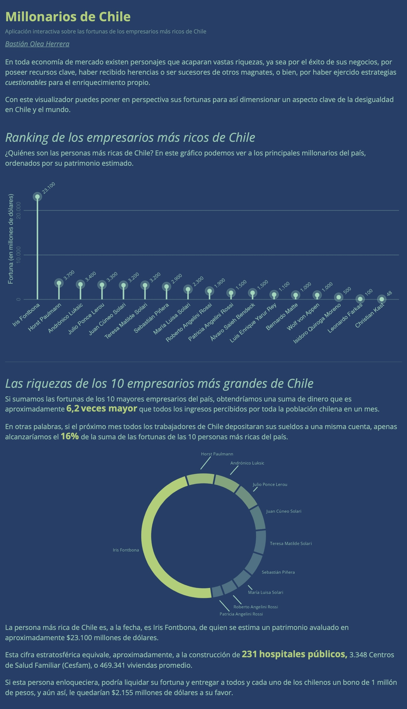
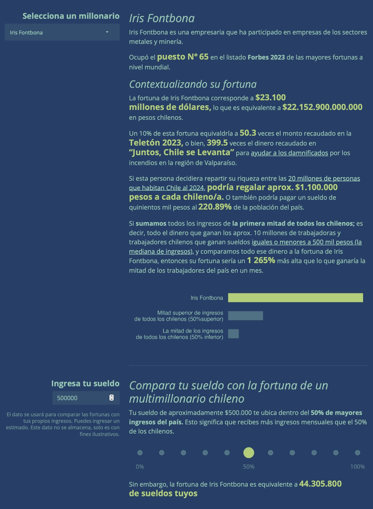
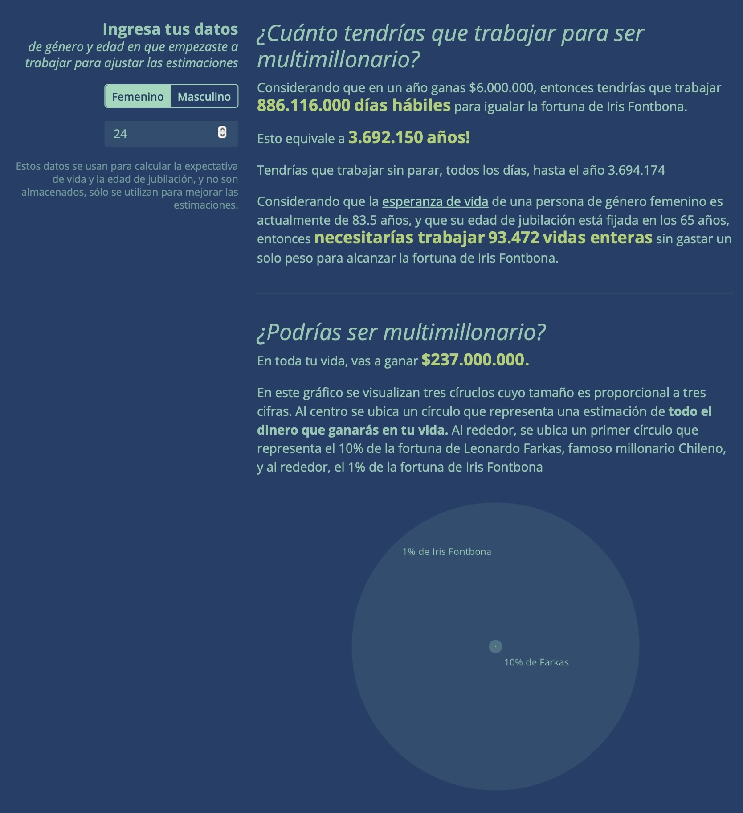

# Millonarios de Chile

[Aplicación web interactiva](https://bastianoleah.shinyapps.io/millonarios_chile/) sobre las fortunas de los empresarios más ricos de Chile.

En toda economía de mercado existen personajes que acaparan vastas riquezas, ya sea por el éxito de sus negocios, por poseer recursos clave, haber recibido herencias o ser sucesores de otros magnates, o bien, por haber ejercido estrategias _cuestionables_ para el enriquecimiento propio.

Con este visualizador puedes poner en perspectiva las fortunas de los millonarios mas grandes del país, comparando sus fortunas con los ingresos de los chilenos, la teletón, tu propio sueldo, y más, para así dimensionar un aspecto clave de la desigualdad en Chile y el mundo. 

### Fuentes
Los datos usados en el visualizador se obtienen de diversas fuentes, principalmente la tabla de **Billonarios de Forbes** obtenida desde [Kaggle](https://www.kaggle.com/datasets/prasertk/forbes-worlds-billionaires-list-2023), pero posteriormente compilados de forma manual en el archivo `millonarios_chile` en la carpeta `datos`.

Los datos sobre los **ingresos** del país, deciles de ingresos y otros se obtienen de la [encuesta Casen 2022](https://observatorio.ministeriodesarrollosocial.gob.cl/encuesta-casen-2022), cuyos datos son dercargados en el script `casen2022_importar.R`, y luego preprocesados y calculados en los scripts `casen2022_procesar.R` y `casen2022_calcular.R`.

La **población de Chile** se obtiene desde las [proyecciones del Censo](https://www.ine.gob.cl/estadisticas/sociales/demografia-y-vitales/proyecciones-de-poblacion), cuyos datos se descargan, limpian y procesan en el script `poblacion_obtener.R`.

El **precio del dólar** se obtiene mediante web scraping del sitio del [Banco Central](https://si3.bcentral.cl/indicadoressiete/secure/IndicadoresDiarios.aspx), por medio de la función `obtener_dolar()` en `funciones.R`.

#### Fuentes de datos
- Lista de billonarios de Forbes 2023, obtenido desde [Kaggle](https://www.kaggle.com/datasets/prasertk/forbes-worlds-billionaires-list-2023)
- [El Mostrador](https://www.elmostrador.cl/mercados/sin-editar-mercado/2013/01/17/los-siete-multimillonarios-de-falabella-que-casi-nadie-conoce-fuera-de-chile/)
- [Rankia](https://www.rankia.cl/blog/mejores-opiniones-chile/2190823-hombres-mas-ricos-chile)
- [El Desconcierto](https://www.eldesconcierto.cl/nacional/2018/12/18/quienes-son-los-von-appen-la-familia-de-origen-nazi-y-duena-de-ultramar-que-tiene-en-jaque-a-los-trabajadores-portuarios.html)
- [Ciper Chile](https://www.ciperchile.cl/2013/12/10/la-historia-del-discreto-empresario-que-se-transformo-en-el-zar-de-las-aguas-en-chile/)
- [Ciper Chile](https://www.ciperchile.cl/2021/10/12/pandora-papers-las-fundaciones-privadas-de-leonardo-farkas-con-las-que-planeo-la-sucesion-de-su-patrimonio-en-panama)
- [Bio Bío Chile](https://www.biobiochile.cl/noticias/economia/negocios-y-empresas/2022/09/08/familia-kast-declara-us86-millones-en-el-extranjero-tras-reestructuracion-de-sus-negocios.shtml)

---- 

Diseñado y programado en R por Bastián Olea Herrera. Magíster en Sociología, data scientist.

https://bastian.olea.biz

bastianolea@gmail.com
